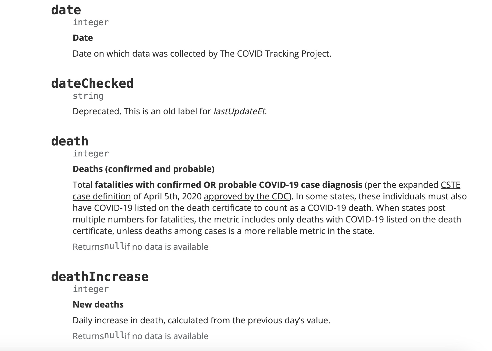

```{r setup, include=FALSE}
library(httr)
library(jsonlite)
library(tidyverse)
library(kableExtra)
library(naniar)
library(glmnet)
library(mice)
library(ggplot2)
library(mgcv)
library(dplyr)
```

## Introduction

The COVID-19 pandemic drastically affected people's lives all over the world. Many people were forced to shelter at home and


### Why it Matters?

Despite the spread of the virus all over the country, some states had different approaches to the pandemic itself (Erwin). Despite the country having the CDC ...

As a group we decided to focus on two states who's public health departments differed and how it affected the spread of COVID-19 in those states.

### Our Goals

Despite national

### Accessing Our Data

In order to access the data of interest, we used an API which provides access to national and state data regarding COVID-19. The initial website used is [Covid-API](https://covidtracking.com/data/api). This website is run by The COVID Tracking Project, a volunteer organization launched by The Atlantic that collected and published data regarding the COVID-19 outbreak. This is an Open API, which means that it’s open to the public to use. There were parameters available regarding specific dates as well as states, but for our particular interests we were only interested in comparing two states, Washington and Alabama.

```{r}
set.seed(123)
res <- GET("https://api.covidtracking.com/v1/states/daily.json")
states_data <- fromJSON(rawToChar(res$content))
```

## Exploratory Data Analysis and Data Cleaning

In order to begin to understand our `states_data`, we take an initial look at the dataset.

```{r}
head(states_data) %>%   kable() %>% 
  kable_styling(full_width = F) %>% 
  scroll_box(width = "100%", height = "200px")
```




We can see from the figure above that there are 56 individual variables. Although there are many variables, not every single one will be useful for our analysis. When you reference the API access site and our `states_data` you're able to see all the variables are listed with a brief description of each one.

After looking through the site and initially looking at the data we're able to remove a good chunk of variables that won't be of use. We also want to isolate the states we're interested in, Washington and Alabama.

```{r}
AL <- states_data %>% 
  filter(state == "AL") %>% 
  select(which(colMeans(is.na(.)) <= 0.35),"death",
         "recovered","onVentilatorCumulative",
         -state,-hash,-checkTimeEt,-dateChecked,
         -hospitalizedCurrently,-hospitalizedCumulative,
         -probableCases,-dateModified,-checkTimeEt,
         -lastUpdateEt,-negative)
AL <- AL %>% select_if(~ length(unique(.)) > 1)

WA <- states_data %>% 
  filter(state == "WA") %>% 
  select(which(colMeans(is.na(.)) <= 0.35),"death",
         "recovered",,"onVentilatorCumulative")
WA <- WA %>% select_if(~ length(unique(.)) > 1)

```


Brief Description

We want to compare the data sets to see what they have in common. From there we're able to isolate the common columns and make those are the ones included in the two individual data sets, `AL` and `WA`.

```{r}
common_columns <- intersect(names(AL), names(WA)) 
common_columns

# Subset each data frame to keep only the common columns
AL <- AL %>% select(all_of(common_columns))
WA <- WA %>% select(all_of(common_columns))

```


```{r}
vis_miss(AL)
```


```{r}
vis_miss(WA)
```


From the variables selected we can see there is a small portion of data missing from each data set. We want to have full data sets in order to analyze so we're going to use imputation to fill those missing values. In this case we're working on predictive mean matching (regression). Here we generate 5 imputed datasets and we take their averages to fill our missing values. It leads to a more robust imputation.

```{r, results='hide', warning=FALSE, cache=T}
imputed_AL <- mice(AL%>%select(-date), m = 5, method = 'pmm', maxit = 50, seed = 500)
AL_complete <- complete(imputed_AL)

imputed_WA <- mice(WA%>%select(-date), m = 5, method = 'pmm', maxit = 50, seed = 500)
WA_complete <- complete(imputed_WA)


```


```{r}
AL_complete$date <- AL$date
WA_complete$date <- WA$date
WA_complete <- WA_complete %>% drop_na(positive, positiveCasesViral)

vis_miss(AL_complete)
vis_miss(WA_complete)
names(WA_complete)
ncol(AL_complete)
nrow(AL_complete)
ncol(WA_complete)
nrow(WA_complete)

```

```{r}
WA$date %>% tail()%>% kable()
AL$date %>% tail() %>% kable()
```

From here we can see that `AL` has 366 entries while `WA` has 420. We want to have an even comparison so we will find the date for `WA` starts on January 14, 2020 while `AL` starts on March 7th, 2020.


```{r}
# Convert date column to Date format
AL_complete$date <- as.Date(as.character(AL_complete$date), format = "%Y%m%d")
WA_complete$date <- as.Date(as.character(WA_complete$date), format = "%Y%m%d")

# Set the baseline date
baseline_date <- as.Date("2020-01-01")

# Compute days since the baseline date
AL_complete$daysSinceStart <- as.numeric(AL_complete$date - baseline_date)
WA_complete$daysSinceStart <- as.numeric(WA_complete$date - baseline_date)
```


#### Correlation Plot

```{r, side-by-side-plots, fig.show="hold", fig.width=4, fig.height=4}
library(corrr)
library(corrplot)
AL_corr <- AL_complete %>% 
  select(-date) %>% 
  cor() %>% 
  corrplot(type = "lower", diag = F)

WA_corr <- WA_complete %>% 
  select(-date) %>% 
  cor() %>% 
  corrplot(type = "lower", diag = F)

  
```

```{r}
# Deaths Over Time Visualization

# Plot for Alabama
ggplot(AL_complete, aes(x = daysSinceStart, y = death)) +
  geom_line(color = "blue") +
  labs(title = "Deaths Over Time (Alabama)", 
       x = "Days Since Jan 1, 2020", y = "Deaths") +
  theme_minimal()

# Plot for Washington
ggplot(WA_complete, aes(x = daysSinceStart, y = death)) +
  geom_line(color = "red") +
  labs(title = "Deaths Over Time (Washington)", 
       x = "Days Since Jan 1, 2020", y = "Deaths") +
  theme_minimal()

```

## Model Fitting

```{r}
# Fit the GAM for the AL_complete data using the selected variables from LASSO
gam_AL <- gam(death ~ s(positive) + s(totalTestResults) + s(hospitalized) + 
                      s(positiveCasesViral) +
                      s(daysSinceStart), 
              data = AL_complete, 
              family = poisson())
summary(gam_AL)
# Plot the smooths
plot(gam_AL, pages = 1, residuals = TRUE, rug = TRUE)
# Check GAM diagnostics
gam.check(gam_AL)
# Plot residuals vs fitted
plot(gam_AL$residuals ~ gam_AL$fitted.values, 
     xlab = "Fitted Values", ylab = "Residuals", main = "Residuals vs Fitted")
abline(h = 0, col = "red")


```

```{r}
# Fit the GAM for the WA_complete data using the selected variables from LASSO
gam_WA <- gam(death ~ s(daysSinceStart) + s(positive) + s(total) + s(positiveIncrease), 
              data = WA_complete, 
              family = poisson())

summary(gam_WA)
# Plot the smooths
plot(gam_WA, pages = 1, residuals = TRUE, rug = TRUE)
# Check GAM diagnostics
gam.check(gam_WA)
# Plot residuals vs fitted
plot(gam_WA$residuals ~ gam_WA$fitted.values, 
     xlab = "Fitted Values", ylab = "Residuals", main = "Residuals vs Fitted")
abline(h = 0, col = "red")

```

### Training and Testing

#### Alabama

```{r}
AL_train_index <- sample(1:nrow(AL_complete), size = 0.7 * nrow(AL_complete)) # 70% training
AL_train_data <- AL_complete[AL_train_index, ]
AL_test_data <- AL_complete[-AL_train_index, ]

trained_gam_AL <- gam(death ~ s(positive) + s(totalTestResults) + s(hospitalized) + 
                s(positiveCasesViral) + s(deathIncrease) +
                s(daysSinceStart), data = AL_train_data) 
              
AL_predictions <- predict(trained_gam_AL, newdata = AL_test_data)
```

```{r}
# Mean Squared Error (MSE)
mse <- mean((AL_test_data$death - AL_predictions)^2)

# Root Mean Squared Error (RMSE)
rmse <- sqrt(mse)

# Mean Absolute Error (MAE)
mae <- mean(abs(AL_test_data$death - AL_predictions))

# Print results
print(list(MSE = mse, RMSE = rmse, MAE = mae))

```

```{r}
# Plot of Actual and Predicted Deaths in Alabama over Time
plot_data <- data.frame(
  daysSinceStart = AL_test_data$daysSinceStart,
  Actual = AL_test_data$death,
  Predicted = AL_predictions
)


ggplot(plot_data, aes(x = daysSinceStart)) +
  geom_line(aes(y = Actual, color = "Actual"), size = 1) +
  geom_line(aes(y = Predicted, color = "Predicted"), size = 1) +
  labs(title = "Actual vs Predicted Deaths Over Time (Alabama)", 
       x = "Days Since Jan 1, 2020", y = "Deaths") +
  scale_color_manual(values = c("Actual" = "blue", "Predicted" = "red")) +
  theme_minimal() +
  theme(legend.title = element_blank())

```

#### Washington

```{r}
WA_train_index <- sample(1:nrow(WA_complete), size = 0.7 * nrow(WA_complete)) # 70% training
WA_train_data <- WA_complete[WA_train_index, ]
WA_test_data <- WA_complete[-WA_train_index, ]

trained_gam_WA <- gam(death ~ s(positive) + s(total) + s(daysSinceStart), 
                      data = WA_train_data) 

WA_predictions <- predict(trained_gam_WA, newdata = WA_test_data)
```

```{r}
# Mean Squared Error (MSE)
WA_mse <- mean((WA_test_data$death - WA_predictions)^2)

# Root Mean Squared Error (RMSE)
WA_rmse <- sqrt(WA_mse)

# Mean Absolute Error (MAE)
WA_mae <- mean(abs(WA_test_data$death - WA_predictions))

# Print results
print(list(MSE = WA_mse, RMSE = WA_rmse, MAE = WA_mae))
```

```{r}
# Plot of Actual and Predicted Deaths in WASHINGTON over Time
WA_plot_data <- data.frame(
  daysSinceStart = WA_test_data$daysSinceStart,
  Actual = WA_test_data$death,
  Predicted = WA_predictions
)


ggplot(WA_plot_data, aes(x = daysSinceStart)) +
  geom_line(aes(y = Actual, color = "Actual"), size = 1) +
  geom_line(aes(y = Predicted, color = "Predicted"), size = 1) +
  labs(title = "Actual vs Predicted Deaths Over Time (Washington)", 
       x = "Days Since Jan 1, 2020", y = "Deaths") +
  scale_color_manual(values = c("Actual" = "blue", "Predicted" = "red")) +
  theme_minimal() +
  theme(legend.title = element_blank())


```

## Conclusion

## Sources

Erwin, P. C., Mucheck, K. W., & Brownson, R. C. (2021). Different Responses to COVID-19 in Four US States: Washington, New York, Missouri, and Alabama. American journal of public health, 111(4), 647–651. <https://doi.org/10.2105/AJPH.2020.306111>


